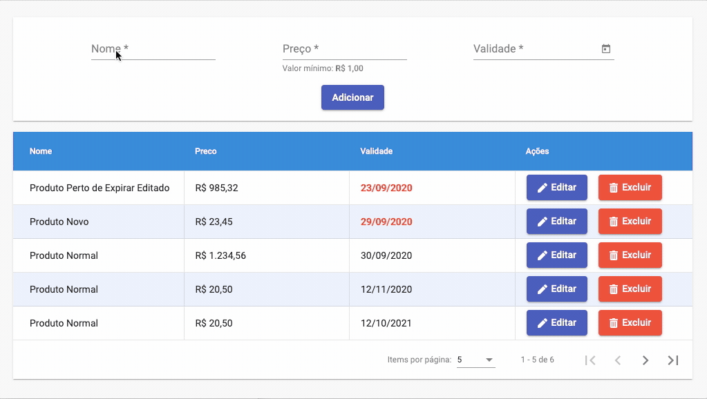

# Produtos Validade API
Deploy: [Produtos Validade API](https://angular-produtos.herokuapp.com/)

### Stack Utilizada
* [Node.JS](https://nodejs.org/)
* [Docker](https://www.docker.com/)
* [Express](https://expressjs.com/)
* [Sequelize](https://sequelize.org/)
* [MySQL](https://www.mysql.com/)
* [express-validator](https://express-validator.github.io/)
* [Jest](https://jestjs.io/)
* [Angular](https://angular.io/)
* [Material UI Angular](https://material.angular.io//)
### Como executar

Para executar é necessário ter o MySQL instalado.
Crie um arquivo *.env* no diretório raiz do projeto com o conteúdo:
```
MYSQL_ROOT_PASSWORD=Senha do MySQL
DB_NAME=Nome do banco de dados
```

Depois de configurado o arquivo *.env*, inicie os serviços do *docker-compose.dev.yaml* com o Docker Compose.

#### Docker Compose
```sh
$ docker-compose -f "docker-compose.dev.yaml" up -d --build
```
